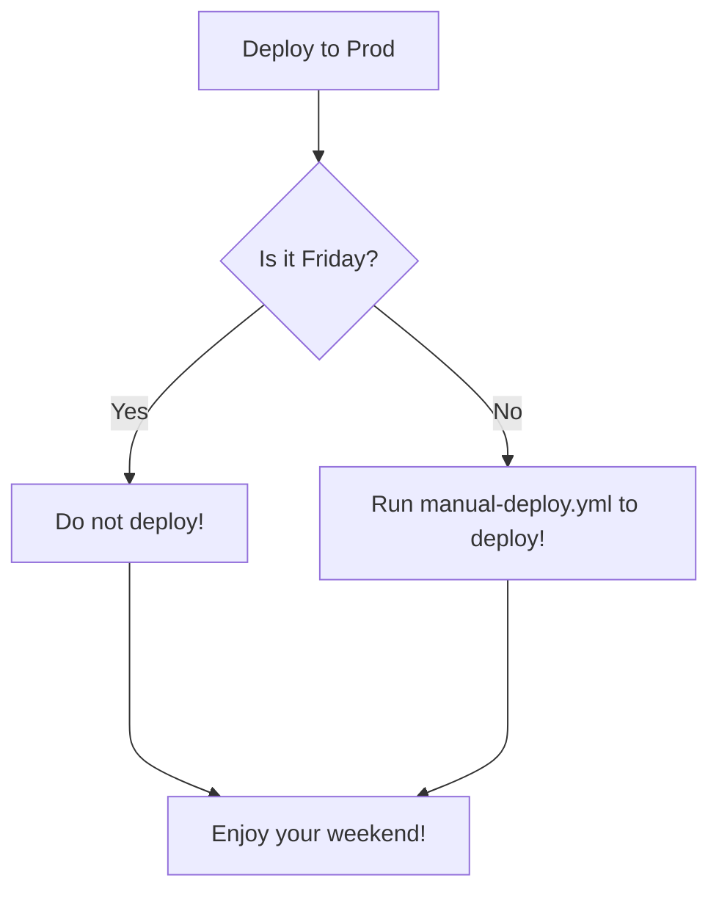

# PoC about React App, GitHub Action and Azure Static Web Apps

This project was bootstrapped with [Create React App](https://github.com/facebook/create-react-app).

## Steps: In the project sample

- [Create React App](https://github.com/facebook/create-react-app)
- [Create a GitHub Repo](https://docs.github.com/en/get-started/quickstart/create-a-repo)
- [Building your first static site in the Azure portal](https://docs.microsoft.com/en-us/azure/static-web-apps/get-started-portal?tabs=react)

## Deployment
- [Use GitHub Actions to deploy](https://github.com/marketplace/actions/azure-static-web-apps-deploy)

### Make your choice

